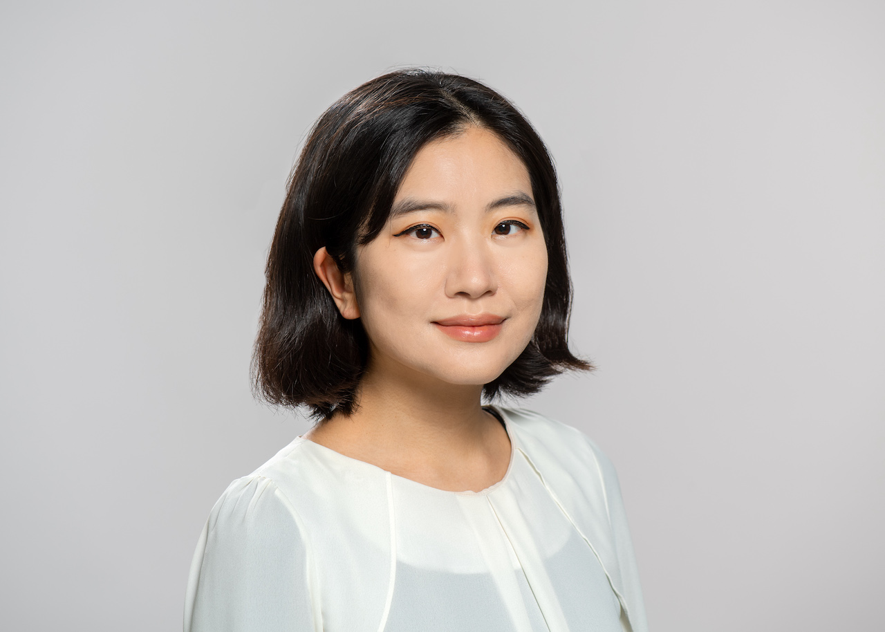

{width=600px}

Hello everyone! 
I am a postdoctoral researcher at Ludwig-Maximilians-Universität München (LMU). I currently work with Professor Imke Hoppe at the Chair of Science communication and climate education ([link](https://www.geo.lmu.de/geographie/en/research/science-communication-and-climate-education/)). 

My academic background spans sociology, media communication, and political science, and I am particularly interested in researching how technology and political elites shape information environment, ultimately affecting attitudes towards sustainability and immigrant integration across countries. You can check my published works here ([Google scholar](https://scholar.google.com/citations?user=AaxICu8AAAAJ&hl=en&authuser=1)).

Originally from Seoul, South Korea, I earned my bachelor’s degree in sociology and media communication at Hanyang University. After graduating, I spent a year working at the political start-up WAGL ([link](http://wagl.net/)), where I participated in projects that promoted grassroots democracy through digitization. These projects included developing online legislation and debate tools in collaboration with politicians and citizens. However, I found the research aspect more fascinating, which led me to move to Mannheim, Germany, to pursue my master's. Since then, I have continued my academic career in Germany.

You can contact me via [email](soyeon.jin59@gmail.com).

