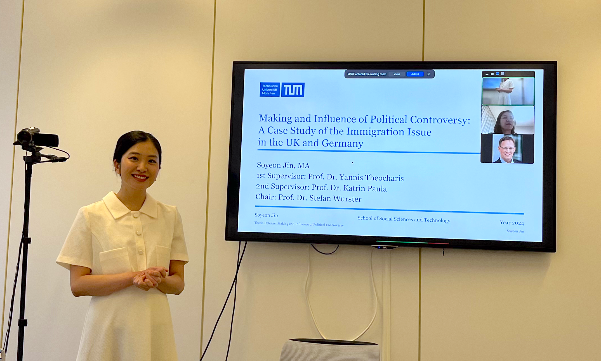

{width=600px}

Hello everyone! 
I am a postdoctoral researcher at the Technical University of Munich (TUM), where I successfully defended my Ph.D. in May 2024. I currently work with Professor Yannis Theocharis at the Chair of Digital Governance ([link](https://www.hfp.tum.de/digitalgovernance/startseite/)). 

My academic background spans sociolgy, media communication, and political science, and I am particularly interested in researching how technology influences immigrant integration and the information environment. You can check my published works here ([Google scholar](https://scholar.google.com/citations?user=AaxICu8AAAAJ&hl=en&authuser=1)).

Originally from Seoul, South Korea, I earned my bachelor’s degree in sociology and media communication at Hanyang University. After graduating, I spent a year working at the political start-up WAGL ([link](http://wagl.net/)), where I participated in projects that promoted grassroots democracy through digitization. These projects included developing online legislation and debate tools in collaboration with politicians and citizens. However, I found the research aspect more fascinating, which led me to move to Mannheim, Germany, to pursue my master's. Since then, I have continued my academic career in Germany.

You can contact me via [email](so.jin@tum.de).

